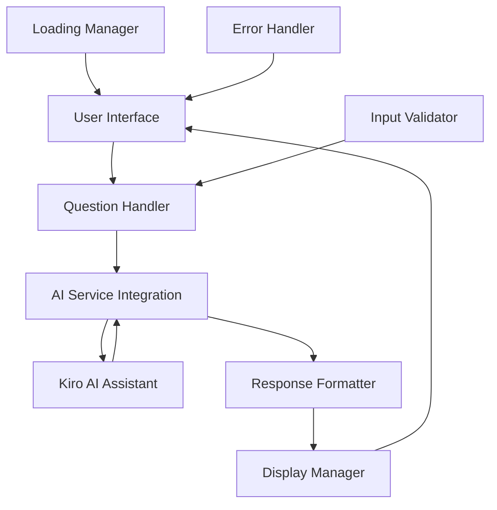

# Design Document: AI Study Assistant

## Overview

The AI Study Assistant is a single-page React application that provides students with AI-powered explanations for academic concepts. The application follows a simple client-side architecture with direct integration to Kiro's AI assistant, eliminating the need for a separate backend service.

The design prioritizes simplicity, responsiveness, and user experience through a clean interface that focuses on the core question-answer interaction. The application maintains no persistent state and requires no user authentication, making it immediately accessible to students.

## Architecture

### High-Level Architecture



### Component Architecture

The application follows a component-driven architecture with the following structure:

- **App Component**: Root component managing overall application state
- **Header Component**: Displays application title and branding
- **QuestionInput Component**: Handles user input and validation
- **ResponseDisplay Component**: Shows AI responses and conversation history
- **LoadingIndicator Component**: Provides visual feedback during processing
- **ErrorDisplay Component**: Shows error messages and retry options
- **OptionalFeature Component**: Implements one of the three optional enhancement features

### Technology Stack

- **Frontend Framework**: React 18+ with functional components and hooks
- **Build Tool**: Vite for fast development and optimized builds
- **Styling**: CSS Modules or Styled Components for component-scoped styling
- **AI Integration**: Direct integration with Kiro AI assistant
- **State Management**: React useState and useEffect hooks (no external state management needed)
- **HTTP Client**: Fetch API for AI service communication

## Components and Interfaces

### Core Components

#### App Component
```typescript
interface AppState {
  currentQuestion: string;
  responses: Response[];
  isLoading: boolean;
  error: string | null;
  optionalFeatureMode: OptionalFeatureType | null;
}

const App: React.FC = () => {
  // Main application logic and state management
}
```

#### QuestionInput Component
```typescript
interface QuestionInputProps {
  onSubmit: (question: string, mode?: OptionalFeatureType) => void;
  isLoading: boolean;
  error: string | null;
}

const QuestionInput: React.FC<QuestionInputProps> = ({ onSubmit, isLoading, error }) => {
  // Input handling, validation, and submission
}
```

#### ResponseDisplay Component
```typescript
interface ResponseDisplayProps {
  responses: Response[];
  isLoading: boolean;
}

const ResponseDisplay: React.FC<ResponseDisplayProps> = ({ responses, isLoading }) => {
  // Response rendering and conversation history
}
```

### AI Service Interface

```typescript
interface AIService {
  generateResponse(question: string, mode?: OptionalFeatureType): Promise<string>;
}

interface AIRequest {
  question: string;
  mode?: 'simple' | 'summary' | 'quiz';
  context?: string;
}

interface AIResponse {
  content: string;
  timestamp: number;
  mode?: OptionalFeatureType;
}
```

### Error Handling Interface

```typescript
interface ErrorHandler {
  handleAPIError(error: Error): string;
  handleValidationError(input: string): string | null;
  handleNetworkError(error: NetworkError): string;
}

type ErrorType = 'validation' | 'network' | 'api' | 'timeout';

interface AppError {
  type: ErrorType;
  message: string;
  retryable: boolean;
}
```

## Data Models

### Question Model
```typescript
interface Question {
  id: string;
  text: string;
  timestamp: number;
  mode?: OptionalFeatureType;
}
```

### Response Model
```typescript
interface Response {
  id: string;
  questionId: string;
  content: string;
  timestamp: number;
  mode?: OptionalFeatureType;
  processingTime?: number;
}
```

### Conversation Model
```typescript
interface Conversation {
  id: string;
  questions: Question[];
  responses: Response[];
  startTime: number;
  lastActivity: number;
}
```

### Optional Feature Types
```typescript
type OptionalFeatureType = 'explain-simple' | 'summarize' | 'generate-quiz';

interface OptionalFeatureConfig {
  type: OptionalFeatureType;
  label: string;
  description: string;
  promptModifier: string;
}
```

### Application State Model
```typescript
interface ApplicationState {
  currentConversation: Conversation;
  uiState: {
    isLoading: boolean;
    error: AppError | null;
    inputValue: string;
    selectedFeature: OptionalFeatureType | null;
  };
  settings: {
    responseTimeout: number;
    maxRetries: number;
    enableOptionalFeatures: boolean;
  };
}
```

## Correctness Properties

*A property is a characteristic or behavior that should hold true across all valid executions of a system-essentially, a formal statement about what the system should do. Properties serve as the bridge between human-readable specifications and machine-verifiable correctness guarantees.*

### Property 1: Question Processing Pipeline
*For any* valid question text, when submitted through the interface, the system should accept the input, send it to the AI service, and initiate the response process without data loss or corruption.
**Validates: Requirements 1.2, 1.4, 2.1**

### Property 2: Response Display Consistency  
*For any* AI-generated response, the system should display the content in a formatted, readable manner within the designated response area and maintain the response-question association.
**Validates: Requirements 2.2, 2.3, 2.4**

### Property 3: Loading State Management
*For any* question submission, the system should immediately show a loading indicator, maintain it during processing, and hide it when the response is received or an error occurs.
**Validates: Requirements 4.1, 4.2, 4.3**

### Property 4: Error Recovery Behavior
*For any* error condition (invalid input, network failure, AI service error), the system should display appropriate error messages and allow users to retry without losing their current input or session state.
**Validates: Requirements 3.2, 3.4**

### Property 5: Multi-Question Session Management
*For any* sequence of questions and responses, the system should clear the input field after successful submissions, maintain previous responses visible, and allow continued interaction without requiring page refresh.
**Validates: Requirements 6.1, 6.2, 6.3**

### Property 6: Responsive Interface Adaptation
*For any* viewport size within the supported range (mobile to desktop), the interface should remain functional and accessible with all core elements properly positioned and interactive.
**Validates: Requirements 5.3**

## Error Handling

### Error Categories and Responses

**Input Validation Errors**:
- Empty or whitespace-only questions: Prevent submission with inline validation message
- Extremely long inputs: Accept but warn about potential processing delays
- Special characters: Accept and sanitize for AI service compatibility

**Network and Service Errors**:
- AI service unavailable: Display "Service temporarily unavailable, please try again" with retry button
- Network timeout: Display "Request timed out, please check your connection" with retry option
- Rate limiting: Display "Too many requests, please wait a moment" with countdown timer

**Application Errors**:
- Component rendering failures: Use React Error Boundaries to catch and display fallback UI
- State corruption: Reset to initial state with user notification
- Browser compatibility issues: Display graceful degradation message with basic functionality

### Error Recovery Mechanisms

**Automatic Recovery**:
- Retry failed requests up to 3 times with exponential backoff
- Preserve user input during error states for easy retry
- Maintain conversation history even after errors

**User-Initiated Recovery**:
- Clear error state button to reset the interface
- Manual retry button for failed requests
- Refresh conversation option to start clean session

### Error Logging and Monitoring

**Client-Side Logging**:
- Log errors to browser console for development debugging
- Track error frequency and types for pattern identification
- Capture user actions leading to errors for reproduction

## Testing Strategy

### Dual Testing Approach

The AI Study Assistant will use both unit testing and property-based testing to ensure comprehensive coverage and correctness validation.

**Unit Tests** will focus on:
- Specific UI component rendering and behavior
- Individual function logic and edge cases
- Integration points between components
- Error boundary functionality
- Mock AI service interactions

**Property-Based Tests** will focus on:
- Universal properties that hold across all inputs
- Comprehensive input coverage through randomization
- State management consistency across interaction sequences
- UI behavior validation across different scenarios

### Property-Based Testing Configuration

**Testing Framework**: We will use **fast-check** for JavaScript/TypeScript property-based testing, which integrates well with Jest and provides excellent random data generation capabilities.

**Test Configuration**:
- Minimum 100 iterations per property test to ensure thorough coverage
- Each property test will reference its corresponding design document property
- Tag format: **Feature: ai-study-assistant, Property {number}: {property_text}**

**Property Test Implementation Requirements**:
- Each correctness property must be implemented by a single property-based test
- Tests should generate realistic input data (questions, responses, UI states)
- Mock AI service responses to ensure deterministic testing
- Validate both successful paths and error conditions

### Unit Testing Balance

Unit tests will complement property-based tests by focusing on:
- **Specific Examples**: Concrete test cases that demonstrate expected behavior
- **Edge Cases**: Empty inputs, maximum length inputs, special characters
- **Integration Testing**: Component interaction and data flow validation
- **Error Conditions**: Specific error scenarios and recovery mechanisms

Property-based tests will handle comprehensive input coverage, while unit tests ensure specific critical paths work correctly and provide clear examples of expected behavior.